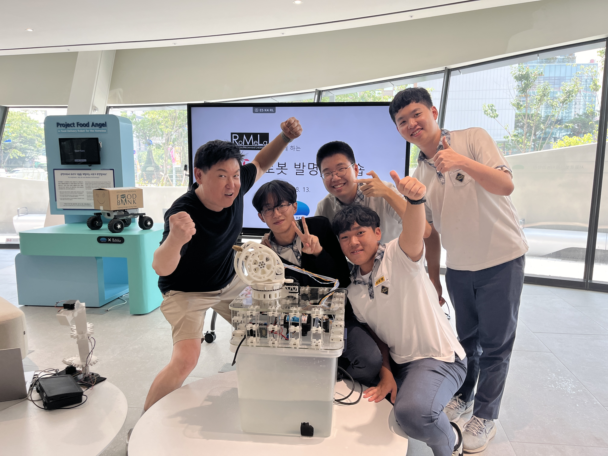

# 🔥 Fire-CANON

> **Automatic Fire Suppression Robot** 🚒🔥
> 
> **2024년 서울로봇인공지능과학관 로봇 발명 워크숍 (with Denis Hong)** - 자동 화재 진압 로봇

  

## 📷 Product Picture
🔗 [View Image](https://iii.ad/2258eb)

## ⚡ Team
**Blackout_Retech** 🏴‍☠️

## 🛠️ Maker
김강현, 조윤혁, 장한수, 송승현

## 📅 Production Period
⏳ 2023.7 ~ 2023.8.13

## 📂 Engineering Files
📁 None

---

## 🔥 Fire-CANON 소개
🚀 **Fire-CANON**은 화재 발생 시 자동으로 불을 감지하고 진압하는 혁신적인 로봇입니다. 서울로봇인공지능과학관에서 진행된 워크숍에서 개발되었으며, 인공지능과 로봇 기술을 융합하여 효과적인 화재 대응 솔루션을 제공합니다. 🔥🤖

### 🎯 주요 기능
- **자동 화재 감지** 🕵️‍♂️: 실시간 열 감지 센서를 활용해 화재를 조기에 감지합니다.
- **지능형 소화 시스템** 🚒: 목표 지점에 정밀하게 소화제를 분사하여 효율적으로 진압합니다.
- **자율 이동 및 장애물 회피** 🤖: AI 기반의 네비게이션 시스템으로 복잡한 환경에서도 원활히 작동합니다.
- **무선 원격 제어** 📡: 사용자가 원격으로 로봇을 조작하고 상태를 모니터링할 수 있습니다.

### 🏆 프로젝트 성과
- ✅ **워크숍 우수 프로젝트 선정** 🏅
- ✅ **실제 화재 상황에서의 테스트 성공** 🔥
- ✅ **서울로봇인공지능과학관 전시 예정** 🎨

### 🌍 향후 발전 방향
Fire-CANON은 향후 더욱 정교한 인공지능 및 센서 기술을 도입하여 **실제 소방 시스템과 연계**할 계획입니다. 또한, 스마트 빌딩 및 산업 시설에서 활용될 수 있도록 연구를 지속할 예정입니다. 💡🏢

💬 **문의 및 협업 제안은 언제든지 환영합니다!** 😊
